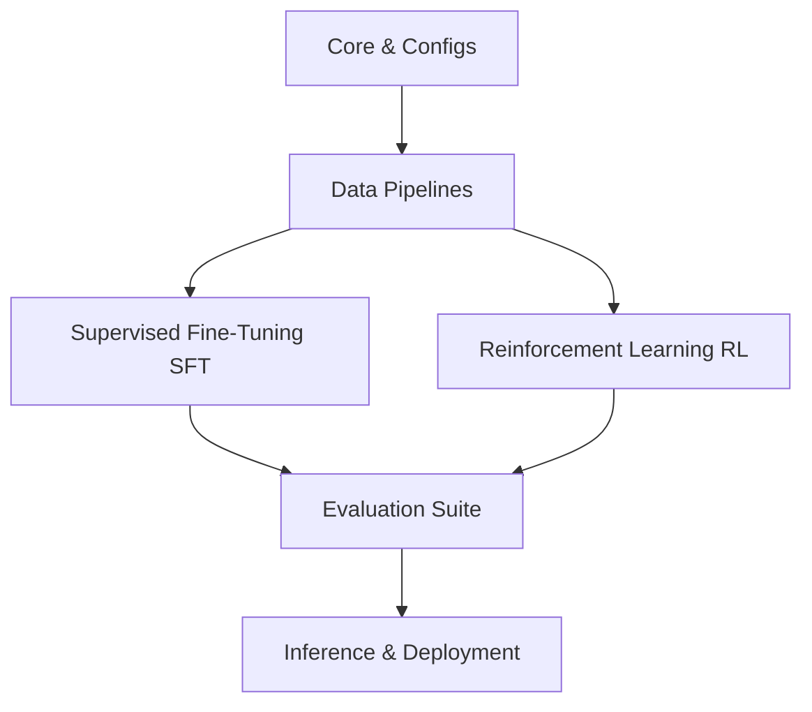

# Architecture

This document outlines the architectural design of the SSP (Spectrum-to-Signal Principle) Framework.

## Module Responsibilities

- **`ssp_framework/core/`**: Hosts base models, custom neural network modules, and the configuration architecture definitions.
- **`ssp_framework/data/`**: Manages tokenization logic, dataset download and streaming, formatting pipelines, and custom data collators.
- **`ssp_framework/supervised/`**: Custom training loop/trainer subclasses for SFT, handling spectrum projection mapping and optimization.
- **`ssp_framework/rl/`**: Implementations of RL optimization algorithms (e.g. GRPO, PPO, DPO, MGPO).
- **`ssp_framework/evaluation/`**: Code for offline testing and benchmarking against scientific reasoning/math evaluations.
- **`ssp_framework/utils/`**: Shared infrastructure helpers (logging, device orchestration, profiling, and checkpoint management).
