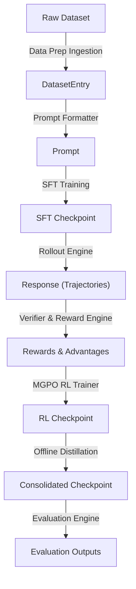

# SSP Core Data Models & Interfaces Design

This document establishes the schemas, interfaces, and abstractions for the LLM Post-Training Lab workspace. Decoupling data structures from execution logic ensures that models, datasets, reward metrics, and alignment algorithms remain interchangeable.

---

## 1. Abstract Base Classes (Interchangeability Layer)

To ensure the repository can easily adapt to future research paradigms (e.g. GRPO, PPO, DPO, or DeepScaleR), all logic is built on top of four core abstractions:

```python
class BaseRolloutEngine(ABC):
    """Generates multiple reasoning paths (rollouts) from a policy model."""
    @abstractmethod
    def generate(
        self, 
        model: PreTrainedModel, 
        prompts: List[Prompt], 
        generation_config: InferenceConfig
    ) -> List[Rollout]:
        pass

class BaseVerifier(ABC):
    """Validates the execution correctness of a generated answer."""
    @abstractmethod
    def verify(
        self, 
        response: Response, 
        ground_truth: DatasetEntry
    ) -> VerificationResult:
        pass

class BaseRewardFunction(ABC):
    """Computes a scalar reward score combining verification outcomes and criteria penalties."""
    @abstractmethod
    def compute_reward(
        self, 
        response: Response, 
        verification: VerificationResult
    ) -> Reward:
        pass

class BaseTrainer(ABC):
    """Orchestrates model optimizations (SFT, RL, Distillation)."""
    @abstractmethod
    def train(self, config: ExperimentConfig) -> None:
        pass
```

---

## 2. Core Data Objects (Schemas)

These data structures represent the message-passing contracts flowing between the modules.

### DatasetEntry
* **Purpose**: Represents a raw, split-specific problem sample loaded from disk or API.
* **Fields**:
  - `id: str` (Unique UUID or sequence hash)
  - `prompt: str` (Raw question or task statement)
  - `ground_truth_answer: str` (Formatted correct output string)
  - `test_cases: Optional[List[Dict[str, Any]]]` (Lists of inputs and expected outputs for code execution verifiers)
  - `metadata: Dict[str, Any]` (Domain, difficulty score, source dataset name, estimated length)

### Prompt
* **Purpose**: Fully formatted prompt payload ready for LLM consumption.
* **Fields**:
  - `id: str` (Maps 1-to-1 with `DatasetEntry.id`)
  - `system_prompt: str` (Directives on formatting reasoning traces, e.g., XML tags)
  - `user_query: str` (Cleaned user question)
  - `formatted_prompt: str` (Concatenated text formatted using the target model's chat template)
  - `metadata: Dict[str, Any]` (Token counts, base model identifiers)

### Response
* **Purpose**: Represents a single candidate text generated by the model.
* **Fields**:
  - `id: str` (Unique generated rollout hash)
  - `prompt_id: str` (Maps back to `Prompt.id`)
  - `text: str` (Raw generated output, containing thinking trace and answer)
  - `thinking_trace: str` (Extracted reasoning content, e.g. text between `<think>` tags)
  - `extracted_answer: str` (Extracted output content, e.g. text between `<answer>` tags)
  - `token_ids: List[int]` (Sequence of generated token integers)
  - `logprobs: List[float]` (Sequence of token-level log probabilities)
  - `metadata: Dict[str, Any]` (Inference temperature, completion stop reason, generation latency)

### Rollout
* **Purpose**: Groups multiple independent response trajectories generated for a single prompt.
* **Fields**:
  - `prompt_id: str` (Maps back to `Prompt.id`)
  - `prompt: Prompt` (Prompt metadata)
  - `trajectories: List[Response]` (Length $N$ array of generated response trajectories)
  - `metadata: Dict[str, Any]` (Group size $N$, active sampling temperature)

### VerificationResult
* **Purpose**: Evaluation breakdown returned by execution and validation checks.
* **Fields**:
  - `trajectory_id: str` (Maps to `Response.id`)
  - `is_correct: bool` (Binary correctness flag)
  - `error_message: Optional[str]` (Compiler stdout, sandbox timeout, or parse warning)
  - `metrics: Dict[str, Any]` (Compiler execution time, number of test assertions passed)

### Reward
* **Purpose**: Scalar rewards mapped to a trajectory, used directly for policy gradient weights.
* **Fields**:
  - `trajectory_id: str` (Maps to `Response.id`)
  - `correctness_reward: float` (Base correctness score, e.g., +1.0 or 0.0)
  - `length_penalty: float` (Deduction for excessive sequence lengths)
  - `format_penalty: float` (Deduction for XML tags violations)
  - `total_reward: float` (Sum of correctness score minus active penalties)
  - `metadata: Dict[str, Any]` (Length scaling weights, clip limits)

---

## 3. Module Interfaces & Contracts

### Data Preparation
* **Inputs**: Raw data source files, splits config, maximum token limit.
* **Outputs**: Serialized list of `DatasetEntry` JSONL maps.
* **Expected Side Effects**: Cache files written locally under `datasets/cache/`.
* **Failure Conditions**: Invalid column templates, corrupted source paths, empty datasets.

### Spectrum SFT
* **Inputs**: Base model name, training `DatasetEntry` records, learning rates.
* **Outputs**: Model checkpoint directory.
* **Expected Side Effects**: Saves updated weight matrices, writes local metrics to logs.
* **Failure Conditions**: PyTorch loss value equals `NaN`, GPU Out of Memory (OOM).

### Rollout Engine
* **Inputs**: Policy model checkpoint, `List[Prompt]`, target rollout group size ($N$).
* **Outputs**: `List[Rollout]` objects.
* **Expected Side Effects**: Dynamic VRAM allocation on local GPU device.
* **Failure Conditions**: Batch generation timeout, out-of-memory crashes.

### Verifier
* **Inputs**: `Response` (Trajectory), `DatasetEntry`.
* **Outputs**: `VerificationResult`.
* **Expected Side Effects**: Executes generated code blocks inside restricted sandboxed subprocesses.
* **Failure Conditions**: Sandboxed thread infinite loop, JSON answer extraction parsing failure.

### Reward Engine
* **Inputs**: `Response`, `VerificationResult`.
* **Outputs**: `Reward`.
* **Expected Side Effects**: None (Pure function).
* **Failure Conditions**: Missing metadata fields.

### MGPO / GRPO RL Trainer
* **Inputs**: Base SFT model (Policy), frozen SFT model (Reference), `List[Rollout]`, `List[Reward]`.
* **Outputs**: Optimized policy model checkpoint.
* **Expected Side Effects**: Updates active weights, prints gradient norms, streams metrics to Tensorboard/Wandb.
* **Failure Conditions**: KL-divergence explosion, gradient vanishing, CUDA OOM.

### Offline Distillation
* **Inputs**: Policy model checkpoint, database of high-reward trajectories ($R_{\text{total}} = 1.0$).
* **Outputs**: Cleaned distilled dataset, target compressed model checkpoint.
* **Expected Side Effects**: Emits static dataset records under `datasets/distilled/`.
* **Failure Conditions**: Low volume of correct trajectories, catastrophic forgetting.

### Evaluation
* **Inputs**: Model checkpoint, target test dataset (e.g. GSM8K, MATH).
* **Outputs**: Accuracies, generation speed metrics, logs.
* **Expected Side Effects**: Saves evaluation predictions array under `outputs/`.
* **Failure Conditions**: Missing evaluation prompt templates, mismatching ground truths.

### Test-Time Scaling (CLR Assessment)
* **Inputs**: Policy model checkpoint, user prompt, search branch depth.
* **Outputs**: Final optimized `Response`.
* **Expected Side Effects**: Performs Monte Carlo branch generation.
* **Failure Conditions**: Max response length budget exhausted.

---

## 4. Folder Ownership & Import Hierarchy

To prevent circular imports and maintain clean code ownership:

```text
SSP-Framework/
├── papers/             # Owns literature research & architecture designs. No code imports.
├── configs/            # Owns Hydra configs. Never imports code. Loaded by training/scripts.
├── datasets/           # Owns ingestion, preprocessing, & verification classes. No external imports.
├── models/             # Owns model wrappers & custom architectural layers. Imports: None.
├── training/           # Owns SFT loops. Imports: models/, datasets/.
├── rl/                 # Owns RL Trainer, Rollouts, and Rewards. Imports: models/, datasets/.
├── evaluation/         # Owns evaluation execution scripts. Imports: models/, datasets/, rl/.
├── notebooks/          # Owns play sandboxes. Imports: anything for testing. Never imported by code.
└── scripts/            # Owns script CLI launchers. Imports: all codebase folders. Never imported by code.
```

---

## 5. Experiment Workflow Lifecycle

The dataflow map outlines how objects move through the post-training stages:



---

## 6. Configuration & Reproducibility Philosophy

### Configuration Separated from Code
- All hyperparameters are defined inside `configs/`. Code files (`training/`, `rl/`) read configs via OmegaConf structures and structure them inside `ExperimentConfig` dataclasses.
- Command-line overrides (e.g. `python -m training.sft model.name=Qwen2.5-Coder-1.5B`) are supported natively.

### Output Layout & Experiment ID
- Every run generates an Experiment ID formatted as: `YYYYMMDD-HHMMSS-<model>-<algo>`.
- Artifact output structure:
```text
outputs/
└── 20260717-175110-smollm-grpo/
    ├── config.yaml          # Frozen run parameters
    ├── train.log            # Complete runtime stdout/stderr log
    ├── checkpoints/         # Periodic weights checkpoints
    │   ├── step_500/
    │   └── final/
    └── eval_results.json    # Validation metric reports
```

### Random Seeding
- Seeding utilities (`set_seed`) must lock: `random`, `numpy`, `torch` CPU/GPU states, and generation generation flags (`do_sample=True`).

---

## 7. Design Review: Potential Bottlenecks & Refactoring Risks

1. **Memory Footprint During RL**:
   - *Risk*: Standard GRPO requires loading the active Policy model and a frozen Reference model concurrently, leading to OOM on single GPU setups.
   - *Fix*: Design `models/wrapper.py` to allow parameter offloading or use parameter-efficient training (LoRA/QLoRA) where the policy shares base weights with the reference model.
2. **Untrusted Code Execution**:
   - *Risk*: A policy model learning competitive programming could write script instructions that delete system files if evaluated directly.
   - *Fix*: Isolate execution inside `datasets/code_verifier.py` using restricted environments with a maximum timeout thread limit.
3. **Data Overhead**:
   - *Risk*: Converting generated text back-and-forth between string, tokens, and token-level log probabilities can degrade training efficiency.
   - *Fix*: Pass structured token outputs directly from the rollout engine to the reward calculating components.
