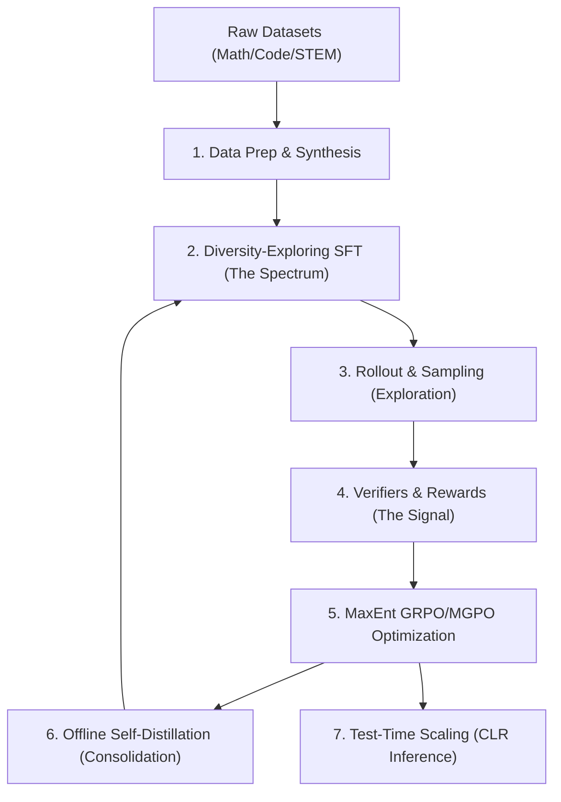
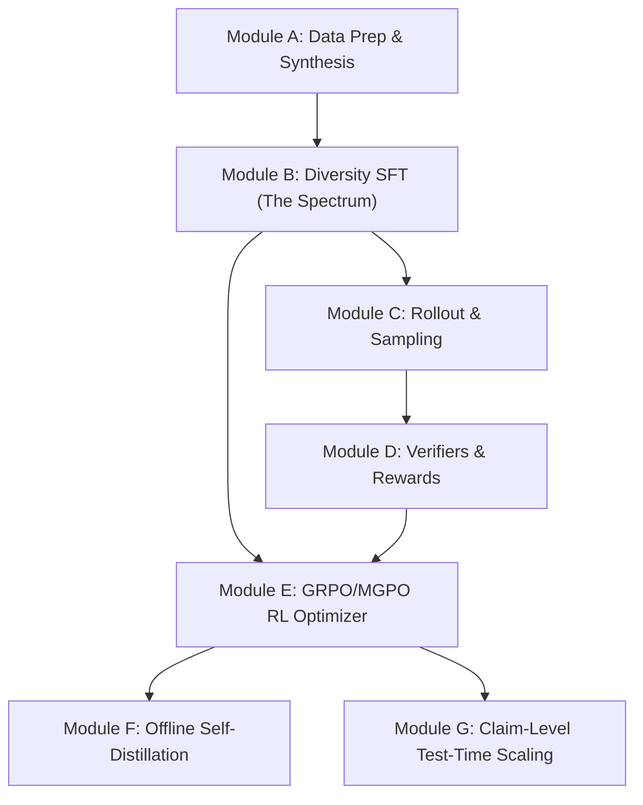

# Spectrum-to-Signal Principle (SSP) Implementation Plan & Architecture

This document serves as the central source of truth and blueprint for the post-training research lab. It outlines the modular design, development stages, dependency graph, implementation milestones, and unresolved questions for reproducing and extending the Spectrum-to-Signal Principle (SSP) inspired by the VibeThinker papers (arXiv:2511.06221, arXiv:2606.16140).

---

## 1. Project Overview & SSP Pipeline

The Spectrum-to-Signal Principle (SSP) decouples LLM reasoning post-training into two distinct operational goals:
1. **The Spectrum Phase (Supervised Fine-Tuning - SFT)**: Building a rich, high-entropy representation of multiple valid reasoning steps and solving trajectories. The objective is to teach the model how to explore different logical paths, avoiding premature convergence on a single target sequence.
2. **The Signal Phase (Reinforcement Learning - RL)**: Filtering, selecting, and amplifying the valid logical signals from the spectrum. Using Group-Relative and MaxEnt-guided policy gradient methods, it reinforces accurate reasoning chains while penalizing incorrect claims and optimizing token-efficiency.

---

## 2. Module Decomposition

### Module A: Data Preparation & Synthesis
- **Purpose**: Process raw problems (math, code, STEM) and structure them into uniform JSONL records. Set up prompt templates that trigger step-by-step thinking traces.
- **Inputs**: Raw datasets (e.g. GSM8K, MATH, LeetCode, MBPP).
- **Outputs**: Tokenized and structured Prompt/Response dictionaries.
- **Dependencies**: None.
- **Expected Difficulty**: **Easy**. Requires simple regex/normalization parsers.

### Module B: Diversity-Exploring SFT (The Spectrum)
- **Purpose**: Train a base language model (e.g., Qwen, SmolLM, TinyLlama, Gemma) to produce a broad "spectrum" of candidate solution pathways.
- **Inputs**: Configured dataset, base model checkpoint.
- **Outputs**: SFT checkpoint.
- **Dependencies**: Module A.
- **Expected Difficulty**: **Medium**. Standard SFT but requires careful curriculum pacing (Stage 1: Multi-domain / general, Stage 2: Long-horizon reasoning paths).

### Module C: Rollout & Sampling (Exploration)
- **Purpose**: Generate multiple ($N$) independent reasoning trajectories per prompt.
- **Inputs**: Active policy model, prompts, temperature/sampling hyper-parameters.
- **Outputs**: Batch of sequences containing prompt + generated reasoning chains.
- **Dependencies**: Module B.
- **Expected Difficulty**: **Medium**. Requires GPU memory-efficient batched inference (e.g. using Hugging Face generate or vLLM).

### Module D: Verifiers & Rewards (The Signal)
- **Purpose**: Compute ground-truth correctness rewards.
  - **Math**: Exact match extraction of final box/equation and evaluation (e.g., using sympy).
  - **Code**: Execution of generated functions against a set of unit test assertions in a subprocess.
  - **Reward shaping**: Penalty for excessive length or formatting issues.
- **Inputs**: Generated rollouts, ground-truth answer strings / test cases.
- **Outputs**: Scalar rewards for each rollout (e.g. correct = 1.0, incorrect = 0.0, with format/length penalties).
- **Dependencies**: Module C.
- **Expected Difficulty**: **Medium-Hard**. Sandboxing code execution safely is critical to prevent malicious writes.

### Module E: MaxEnt GRPO / MGPO Optimization
- **Purpose**: Update the policy parameters. 
  - **GRPO**: Calculates group-relative advantages (normalizing rewards within the $N$ group rollouts of a single prompt) to bypass the need for a separate critic model.
  - **MGPO**: Introduces maximum entropy regularization to ensure the policy maintains diversity and doesn't collapse to a single mode. Scales optimization gradients on samples near the model's current capability boundary.
- **Inputs**: Policy model, Reference model (frozen copy), Rollout texts, Rewards, Advantages.
- **Outputs**: Policy checkpoint updates.
- **Dependencies**: Module B, Module D.
- **Expected Difficulty**: **Hard**. Involves customizing loss functions (Policy gradient + KL divergence constraint + MaxEnt weight) and handling multi-GPU gradients.

### Module F: Offline Self-Distillation
- **Purpose**: Consolidate correct reasoning paths. Extract high-reward rollouts generated during RL, refine/format them, and fine-tune the policy or base model offline.
- **Inputs**: Successful trajectories from Module E.
- **Outputs**: Optimized distilled model.
- **Dependencies**: Module E.
- **Expected Difficulty**: **Medium**. Simple SFT cycle but requires rigorous deduplication and filtering.

### Module G: Test-Time Scaling (CLR Assessment)
- **Purpose**: Assess claim-level reliability during inference. Traverses multiple reasoning paths, scores intermediate claims, and selects the most mathematically or logically sound completion.
- **Inputs**: Trained policy model, prompt, number of search trajectories.
- **Outputs**: High-fidelity final verified response.
- **Dependencies**: Module E.
- **Expected Difficulty**: **Medium-Hard**. Requires claim extraction heuristics and Monte Carlo rollouts.

---

## 3. Dependency Graph

The dependencies dictate the order in which we must build the components.

---

## 4. Development Roadmap & Milestones

Each milestone yields an independently verifiable deliverable.

### Milestone 1: Data Pipeline & Verification Engine
- **Objective**: Establish the ingestion flow and automated correctness checkers for Math (Sympy) and Code (exec sandbox).
- **Deliverables**:
  - `datasets/math_verifier.py`
  - `datasets/code_verifier.py`
  - Unit tests executing edge cases (e.g. equivalence of math equations like $x/2$ and $0.5x$).
- **Expected Outputs**: A Python test run demonstrating 100% correct evaluations of correct/incorrect mock model answers.
- **Completion Criteria**: Passing all verification tests.

### Milestone 2: Model-Agnostic Spectrum SFT
- **Objective**: Implement the training script capable of fine-tuning different base models (Qwen, SmolLM, Gemma) to write step-by-step thinking traces.
- **Deliverables**:
  - `models/wrapper.py` (flexible base model loader)
  - `training/sft.py` (multi-stage curriculum training script)
- **Expected Outputs**: Fine-tuned model checkpoints producing `<think> ... </think>` blocks.
- **Completion Criteria**: The fine-tuned model output matches the target reasoning format and passes basic validation loss checks.

### Milestone 3: Group Rollouts & Verification Loop
- **Objective**: Implement batched generation of multiple reasoning traces and reward scoring.
- **Deliverables**:
  - `rl/rollout.py` (batched sampling generator)
  - `rl/rewards.py` (combining correctness verification and format/length penalty scoring)
- **Expected Outputs**: A JSON file containing prompts, $N$ generated rollouts per prompt, and their respective scores.
- **Completion Criteria**: Correct execution of rollout-generation-scoring loop with mock policy models.

### Milestone 4: GRPO/MGPO Training Pipeline
- **Objective**: Connect the rollout/rewards outputs to the policy gradient optimization loop.
- **Deliverables**:
  - `rl/grpo_trainer.py` (group relative advantage calculation, KL constraint, gradient step)
  - `rl/mgpo_trainer.py` (adds maximum entropy term and domain weighting)
- **Expected Outputs**: Active reinforcement learning training checkpoints and loss curves.
- **Completion Criteria**: Successful decrease in KL-divergence while scaling task reward metrics on validation tasks.

### Milestone 5: Offline Consolidation & Test-Time Scaling
- **Objective**: Add offline distillation and Claim-Level Reliability (CLR) inference search.
- **Deliverables**:
  - `rl/distillation.py` (filtering and secondary fine-tuning)
  - `evaluation/clr_search.py` (Monte Carlo search / Best-of-N inference scoring)
- **Expected Outputs**: Optimized distilled checkpoints; script evaluating test-time accuracy scaling.
- **Completion Criteria**: Test-time scaling achieves higher accuracy on test sets (e.g. GSM8K) than direct single-path greedy decoding.

---

## 5. Identification of Research Unknowns

### Specified in the VibeThinker Papers
1. **Two-Phase Post-Training**: Explicit decoupling of diversity exploration (SFT) and signal reinforcement (RL).
2. **MGPO Algorithm**: Using Group-Relative advantages, KL constraints, and boundary capability sample weighting.
3. **Parametric Hypothesis**: Deciding to target compact reasoning tasks (math, code) on SLMs instead of general knowledge.
4. **Length Penalty / Long2Short**: Specifically targeting shorter trajectories in late Math RL to reward computational efficiency.

### Left Unspecified / Implementation Choices
1. **Verifiers Implementation**: The exact parsing scripts to isolate final values in mathematical responses or isolate Python code blocks are not detailed.
2. **Entropy Scale**: The exact weight coefficient ($\beta$) for maximum entropy regularization in MGPO is not provided.
3. **Execution Security Sandbox**: The papers do not describe how to safely execute arbitrary code produced by the policy without compromising the host environment.
4. **Hyperparameters**: Specific optimizer learning rate schedules, batch sizes for 3B parameter models, and KL divergence anchors are absent.

### Our Project Assumptions
1. **Code Verification**: We will run code execution in isolated Python subprocesses with a timeout restriction (e.g. 5 seconds) to prevent infinite loops.
2. **Base Prompts**: We assume a custom XML tag format (e.g. `<think> ... </think> <answer> ... </answer>`) to structured rollouts.
3. **Simulated Boundaries**: For domain boundary weighting in MGPO, we will select samples where $20\% \le \text{Accuracy} \le 80\%$ within the rollout group.

---

## 6. Implementation Philosophy

To avoid over-engineering and ensure steady progress:
1. **Reproducibility First**: Lock random seeds and document hyperparameters inside `configs/`. Every result should be reconstructible.
2. **Modular Design**: Decouple model definitions (`models/`) from data (`datasets/`) and optimization algorithms (`rl/`). Swapping Gemma for Qwen should require changing a single string in the config.
3. **Simple over Clever**: Write plain PyTorch loops where possible. Avoid complex nesting or custom abstractions unless they offer significant readability gains.
4. **Traceable to Paper**: Insert inline comments linking directly to equations or sections of the VibeThinker-1.5B or VibeThinker-3B papers.
5. **Independently Testable**: Maintain verification scripts to validate rollouts and reward outputs before connecting them to the policy gradient optimizer.
